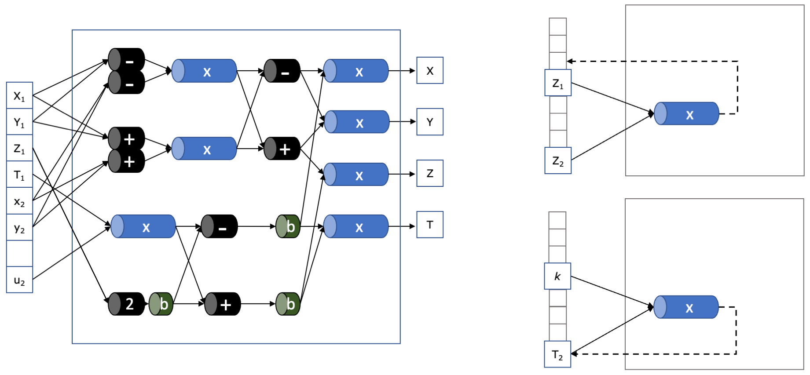

<h1 align="center">
<a href="zprize-fpga-msm.pdf">FPGA Acceleration of Multi-Scalar Multiplication</a>
</h1>
<h2 align="center">
ZPrize 2022
 
Kaveh Aasaraai, Don Beaver, Emanuele Cesena, Rahul Maganti,
 
Nicolas Stalder and Javier Varela
</h2>

## 

[jumpcrypto]: https://jumpcrypto.com/
[zprize-msm]: https://www.zprize.io/prizes/accelerating-msm-operations-on-gpu-fpga
