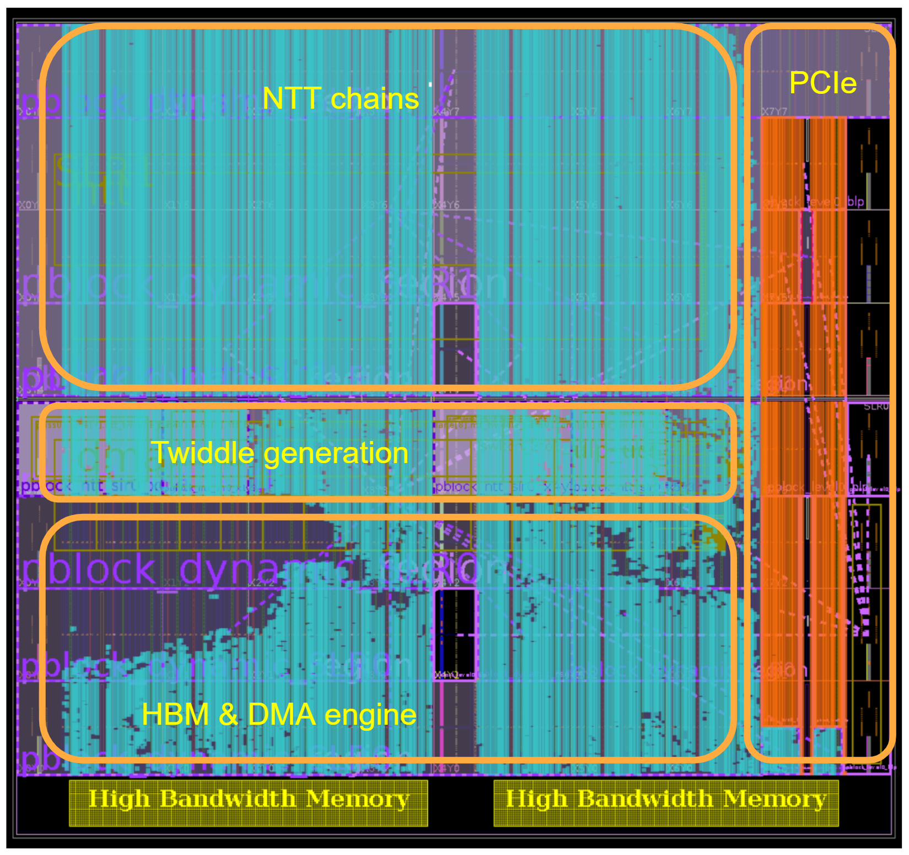

# Nantucket
The Nantucket platform is a submission to the ZPRIZE competition under
the category, "Accelerating NTT Operations on an FPGA."

## Table of Contents

  * [Overview](#overview)
    + [NTT Engine](#ntt-engine)
    + [DMA Engine](#dma-engine)
  * [Build and Run Instructions](#build-and-run-instructions)
    + [Environment Setup](#environment-setup)
    + [HW Emulation Target](#hw-emulation-target)
    + [HW Target](#hw-target)
  * [Results](#results)
    + [Utilization](#utilization)
    + [Clock Frequencies](#clock-frequencies)
    + [Execution Metrics](#execution-metrics)
    
## Overview
The Nantucket design was divided into two pieces, the NTT Engine that performs the NTT calculations
on the points and the DMA Engine which moves points to and from HBM memory.

```
     +---------------------------------------------------------------------+
     | +----------------------------------------------------+              |
     | |   XRT Kernel                                       |              |
     | |   ___________________________                      |              |
     | |  |  NTT Engine               |        ___ ____     |              |
     | |  |  _________   ___________  |       |        |    |              |
     | |  | | Twiddle | |   FFT     | |<------|  DMA   |<-->|- s_axilite   |
     | |  | | Factor  | | Butterfly | |       | Engine |    |              |
     | |  | |  Gen    | | Pipeline  | |------>|        |<-->|- m_axi[31:0] |
     | |  | |_________| |___________| |       |________|    |              |
     | |  |___________________________|                     |              |
     | |                                                    |              |
     | |                                                    |              |
     | |----------------------------------------------------+              |
     |                                                                     |
     |   xilinx_u55n_gen3x4_xdma_2_202110_1 base platform                  |
     +---------------------------------------------------------------------+
            |                |
        +-------+        +-------+
        |  HBM  |        |  PCIe |
        +-------+        +-------+
```

### NTT Engine

The Supranational Z-prize NTT engine is a highly parallelized NTT engine.  A 2<sup>24</sup> NTT is achieved by performing two
passes through the engine.  The engine includes on-chip twiddle factor generation and bit reverse operations.

The engine includes 12*16 = 192 butterfly units which can perform approximately 192 * 450 MHz = 86.4 G butterfly calculations
per second.  This yields a 2<sup>24</sup> NTT in approximately 2.3 mSec.  HBM bandwidth required to support this operation
is 2<sup>24</sup> * 8 byte/point * (2x read + 2x write) / 2.3 mSec = 233 GB/sec.

#### 2<sup>24</sup> NTT Using 2 Passes through the NTT Engine

To achieve a 2<sup>24</sup> NTT using our 2<sup>12</sup> engine it is convenient to think of the 2<sup>24</sup> points as a 2D array of size 2<sup>12</sup> points
x 2<sup>12</sup> points.  With the Gentleman-Sande computation schedule, the first pass through the engine computes 2<sup>12</sup> NTTs
columnwise over the 2D array.  That is to say, the 2<sup>12</sup> points for which the NTTs are computed are separated by a stride of
2<sup>12</sup> points within the original 2<sup>24</sup> point array.  The second pass through the engine computes NTTs on 2<sup>12</sup> point rows.
The 2D array of points is thus referenced using both a column major access pattern (1st pass) and a row major access pattern (2nd pass).

#### Gentleman-Sande Butterfly with Constant Geometry RAMs

The fundamental building block within the NTT engine is a Gentleman-Sande butterfly unit paired with a set of RAMs
configured for a constant geometry access pattern (CGRAMs).  Points and twiddle factors stream through the block with a
throughput of one butterfly operation per cycle.  The 2 RAMs Xa and Xb (see diagram below) are dual ported such that the
2 points computed by the butterfly unit can be written into the RAMs at the same time as 2 points are read from the
RAMs and delivered to the butterfly unit of the downstream block.  In a similar fashion, 2 RAMs are used to pipe along
the twiddle factors which are needed by downstream blocks.  Accesses to the RAMs are organized in a "constant geometry"
pattern.

```
                                +----------+
                                |          |
    W0 ---------------------->  |    Wa    | -----------> W0'
                                |          |
                                +----------+
                                +----------+
                                |          |
    X0 ------ + ------------->  |    Xa    | -----------> X0'
         \  /                   |          |
          \/                    +----------+
          /\                    +----------+
         /  \                   |          |
    X1 ------ - * ----------->  |    Xb    | -----------> X1'
                |               |          |
                |               +----------+
                |               +----------+
                |               |          |
    W1 ---------+               |    Wb    | -----------> W1'
                                |          |
                                +----------+
```

Using this construction addresses the 2 major challenges faced by NTT circuits.  Butterfly calculations are notoriously
difficult from a routing perspective due to the inherent wire crossings which occur (just think about the butterfly diagram
for a moment).  With the above strategy wire crossings are limited to pairs of points, and are performed in part within the
RAMs themselves.  The construction also addresses the challenge in delivering points to butterfly units with sufficient
bandwidth.  Using distributed RAMs intermingled with butterfly units eliminates the complexity associated with high
bandwidth links between a central RAM and computation engines.

In our construction we pipe twiddle factors along with the points.  This allows the NTT computation pipeline to remain the
same whether twiddle factors are referenced from a table in DRAM or generated on the FPGA. Gentleman-Sande rather than
Cooley-Tukey was chosen because it allows twiddle factors to be retired most quickly.  In the above diagram, input twiddles
W1 are consumed by the computation unit.  Only twiddles W0 need to be passed to downstream stages.  Each butterfly stage
consumes 1/2 of the remaining twiddles.

#### Butterfly Unit

Care was taken in designing the butterfly unit to take maximum advantage of the FPGA DSPs.  Mapping of the Goldilocks
field multiply, reduce, and add/sub to DSP elements was performed by hand in a way that allowed flexibility in the
number of DSP elements used per butterfly.  The multiply is always performed in DSP elements.  Options for # of DSP
elements per butterfly unit are as follows:

| BFLYDSP | DSP use                                        |
| ------- | ---------------------------------------------- |
| 12      | 64x64 multiply                                 |
| 16      | 64x64 multiply, 64-bit add/sub                 |
| 24      | 64x64 multiply, 64-bit add/sub, 32-bit add/sub |

Experiments indicated that the choice of 12 DSPs per butterfly unit to be optimal.  This choice allowed 500MHz+
operation in a sparsely filled FPGA, with balanced utilization between DSPs, LUTs, etc.

#### Butterfly-CGRAM Chains

The butterfly-CGRAM fundamental building blocks are joined together in chains to form the NTT compute datapath.  Our design
utilizes 16 chains.  These chains are somtimes called lanes in the RTL code.

A single chain consists of 12 butterfly units.  Between the butterfly units are constant
geometry RAMs (CGRAMs).  By choosing an appropriate order for the butterfly calculations we can arrange for the size of
most of the CGRAMs to be quite modest (2<sup>5</sup> points).  We do need full 2<sup>12</sup> sized CGRAMs at points in the chain.  As depicted
below these are at the 1st and middle positions in the chains.  (In our actual design the 1st CGRAM stages are omitted as
we have folded this functionality into our HBM DMA engine FIFOs).  The final element in the chain is a RAM and logic to
achieve the bit reverse function.  2<sup>12</sup> sized RAMs are required for this.

Twiddle factor generation is performed outside of the NTT computation chains.  Points from the HBM DMA system are paired
with twiddle factors from the twiddle generator (TG) as they are handed to the computation chains.

```
      +----+   +----+  +----+  +----+  +----+  +----+  +----+  +----+  +----+  +----+  +----+  +----+  +----+  +----+
      |    |   |    |  |    |  |    |  |    |  |    |  |    |  |    |  |    |  |    |  |    |  |    |  |    |  |    |
Xi[0]--------->| CG |->| BF |->| CG |->| BF |->| CG |->| BF |->| CG |->| BF |->| CG |->| BF |->| CG |->| BF |->| CG |
      |    |-->|2^12|  |    |  |2^5 |  |    |  |2^5 |  |    |  |2^5 |  |    |  |2^5 |  |    |  |2^5 |  |    |  |2^12|
      |    |   +----+  +-----  +----+  +-----  +----+  +-----  +----+  +-----  +----+  +-----  +----+  +----+  +----+
      |    |                                                                                                     | 
      |    |   +----+  +----+  +----+  +----+  +----+  +----+  +----+  +----+  +----+  +----+  +----+  +----+    |
      |    |   |    |  |    |  |    |  |    |  |    |  |    |  |    |  |    |  |    |  |    |  |    |  |    |    |
Xo[0]<---------| BR |<-| BF |<-| CG |<-| BF |<-| CG |<-| BF |<-| CG |<-| BF |<-| CG |<-| BF |<-| CG |<-| BF |<----
      |    |   |2^12|  |    |  |2^5 |  |    |  |2^5 |  |    |  |2^5 |  |    |  |2^5 |  |    |  |2^5 |  |    |
      |    |   +----+  +-----  +----+  +-----  +----+  +-----  +----+  +-----  +----+  +-----  +----+  +-----
      |    |
      |    |   +----+  +----+  +----+  +----+  +----+  +----+  +----+  +----+  +----+  +----+  +----+  +----+  +----+
      |    |   |    |  |    |  |    |  |    |  |    |  |    |  |    |  |    |  |    |  |    |  |    |  |    |  |    |
Xi[1]--------->| CG |->| BF |->| CG |->| BF |->| CG |->| BF |->| CG |->| BF |->| CG |->| BF |->| CG |->| BF |->| CG |
      |    |-->|2^12|  |    |  |2^5 |  |    |  |2^5 |  |    |  |2^5 |  |    |  |2^5 |  |    |  |2^5 |  |    |  |2^12|
      |    |   +----+  +-----  +----+  +-----  +----+  +-----  +----+  +-----  +----+  +-----  +----+  +----+  +----+
      | TG |                                                                                                     | 
      |    |   +----+  +----+  +----+  +----+  +----+  +----+  +----+  +----+  +----+  +----+  +----+  +----+    |
      |    |   |    |  |    |  |    |  |    |  |    |  |    |  |    |  |    |  |    |  |    |  |    |  |    |    |
Xo[1]<---------| BR |<-| BF |<-| CG |<-| BF |<-| CG |<-| BF |<-| CG |<-| BF |<-| CG |<-| BF |<-| CG |<-| BF |<----
      |    |   |2^12|  |    |  |2^5 |  |    |  |2^5 |  |    |  |2^5 |  |    |  |2^5 |  |    |  |2^5 |  |    |
      |    |   +----+  +-----  +----+  +-----  +----+  +-----  +----+  +-----  +----+  +-----  +----+  +-----
      |    |
      .    .   ......  ......  ......  ......  ......  ......  ......  ......  ......  ......  ......  ......  ......
      |    |
      |    |   +----+  +----+  +----+  +----+  +----+  +----+  +----+  +----+  +----+  +----+  +----+  +----+  +----+
      |    |   |    |  |    |  |    |  |    |  |    |  |    |  |    |  |    |  |    |  |    |  |    |  |    |  |    |
Xi[15]-------->| CG |->| BF |->| CG |->| BF |->| CG |->| BF |->| CG |->| BF |->| CG |->| BF |->| CG |->| BF |->| CG |
      |    |-->|2^12|  |    |  |2^5 |  |    |  |2^5 |  |    |  |2^5 |  |    |  |2^5 |  |    |  |2^5 |  |    |  |2^12|
      |    |   +----+  +-----  +----+  +-----  +----+  +-----  +----+  +-----  +----+  +-----  +----+  +----+  +----+
      |    |                                                                                                     | 
      |    |   +----+  +----+  +----+  +----+  +----+  +----+  +----+  +----+  +----+  +----+  +----+  +----+    |
      |    |   |    |  |    |  |    |  |    |  |    |  |    |  |    |  |    |  |    |  |    |  |    |  |    |    |
Xo[15]<--------| BR |<-| BF |<-| CG |<-| BF |<-| CG |<-| BF |<-| CG |<-| BF |<-| CG |<-| BF |<-| CG |<-| BF |<----
      |    |   |2^12|  |    |  |2^5 |  |    |  |2^5 |  |    |  |2^5 |  |    |  |2^5 |  |    |  |2^5 |  |    |
      +----+   +----+  +-----  +----+  +-----  +----+  +-----  +----+  +-----  +----+  +-----  +----+  +-----
```

#### Bit Reversal

The NTT engine performs bit reversal during the course of the NTT computation.  This is accomplished by bit reversing
each pass of the NTT at the tail end of the butterfly-CGRAM chains (see the BR blocks above).  A final step is
required to complete the bit reversal across the two passes.  It turns out this is as simple as writing back the 2nd pass
results using the column major access pattern (rather than row major access pattern).

#### Twiddle Factor Generation

Twiddle factor generation is performed outside of the NTT computation chains.  This allows the same NTT computation
core to be used with either twiddle factors provided from RAM lookup tables or from an on chip twiddle factor generation
block.  The approach does perhaps require more twiddles to be produced than more integrated approaches.  For each 2<sup>12</sup> NTT
processed by a chain, 2<sup>12</sup> - 1 twiddle factors need to be provided: 2<sup>11</sup> for the 1st butterfly stage, 2<sup>10</sup> for the 2nd butterfly stage,
etc.  An alternative approach could perhaps reduce the number of twiddles needed to simply 2<sup>11</sup>.

FPGA generation of twiddles is performed by a combination of LUT and computation.  A LUT provides the 2<sup>12</sup> - 1 twiddles
needed for the 2nd pass.  In this pass, all chains receive the same set of twiddles.  The twiddles for the 1st pass are
generated by a multiply/reduce of the 2nd pass LUT twiddles with accumulated running twiddles.  Two multiplication/reduction (mul/red) units per
lane are required to combine the LUT twiddles and running twiddles,  and an additional mul/red unit is used to compute the
running twiddles required for the next 2<sup>12</sup> NTT.  This additional unit can be either a
single additional unit for the engine or an additional unit per chain.  For our 16 chain engine we use one additional
mul/red unit per chain to compute the running twiddles.  Our total multiplication/reduction unit count per chain is 15:
12 for the 12 butterfly stages and 3 for per chain twiddle generation.

#### Dual Pipeline NTT Engine Optimizations

For our Z-prize design we chose to instantiate a single NTT pipeline consisting of 16-lanes.  The 2<sup>24</sup> NTT is
accomplished by this pipeline by running the pipeline twice in succession against the data.

An alternative approach is to instantiate dual 8-lane NTT pipelines.  One of the pipelines could then perform the 1st
pass processing, with the second pipeline completing the NTT.  The time to complete the NTT with the dual pipeline will be
about 2x that of the single 16 lane pipeline (2x the time because the dual pipeline has only 1/2 the # of processing
chains).  However, note that with the dual pipeline we can work on 2 different NTTs simultaneously.  So, while the
latency of the dual pipeline is 2x that of the single pipeline, from a throughput standpoint, the dual pipeline approach
delivers the same performance.

An advantage of the dual pipeline approach is that the two pipelines can be optimized for the specific pass they are tasked
to handle.  In particular, resource saving optimizations can be made to the 2nd pass pipeline.  Because the twiddle factors
for all chains are identical in the 2nd pass, significant reductions can be made in the twiddle generation and twiddle
pipelining logic.   In addition, the final two butterfly stages of the 2nd pass pipeline can be simplified.  In the final
stage, the twiddle factor is 1, so the multiplication/reduction can be entirely eliminated.  In the 2nd to last stage the
twiddle factor is either 1 or (1<<48).  In this case, the 64x64 multiplier can be replaced with an optional 48 bit shift.
Our experiments indicate that the dual 8-chain solution uses about 20% fewer FPGA resources than the single 16-chain
solution.

### DMA Engine

The DMA Engine's sole responsibility is feeding points to the NTT Engine and sinking
points from the NTT Engine at the NTT Engine's peak processing rate.  With the
NTT Engine capable of consuming 32 points and producing 32 points per cycle and
an NTT Engine clock rate nearing 500MHz, the feed and sink rates are both
125 GB/sec.  At a peak bandwidth of 460 GB/sec, the FPGA's HBM
memory is the only available resource capable of supporting the combined
feed and sink bandwidth need of 250 GB/sec while also providing enough
storage for 2<sup>24</sup> points.

There are a number of factors that make extracting 460 GB/sec bandwidth
from HBM difficult.  The HBM memory subsystem is split into 32 channels, each
capable of 1/32nd of 460 GB/sec or about 14 GB/sec.  The only
way to achieve the 250 GB/sec need is to distribute the 2<sup>24</sup>
points across the 32 channels in some fashion.  Use of a single channel alone
would not suffice.

#### Read-Write Turnaround

Like all synchronous DRAMs, HBM requires dead cycles between read and writes
commands to safely turnaround the shared DRAM data bus.  Dead cycles
reduce the usable bandwidth so their reduction or elimination is a desirable
feature.  Half of the HBM bandwidth, or 16 channels worth of bandwidth, is
sufficient to supply the NTT Engine with points.  Likewise, the remaining
half of the channels provides sufficient bandwidth to sink the points from
the NTT Engine.  By using 16 HBM channels to store the inputs points and the
other 16 channels to store the output points, no read-write or write-read DRAM
turnaround bandwidth loss is incurred.  For the NTT Engine's first computation
pass, the even channels hold the input points and the odd channels receive
the output points.  For the NTT Engine's second computation pass, the output
from the first pass in the odd channels are read back as input and the
resulting points are written back into the even channels, overwriting the
original input points that are no longer needed.

#### Dynamic Refresh

HBM is constructed from DRAM, requiring periodic
refreshes to maintain the state of its capacitive memory.  Experimentation
showed that the dynamic refresh overhead of HBM from the FPGA's memory
controllers reduced the available bandwidth by 20% leaving 360 GB/sec.
When dynamic refresh occurs, the FPGA's memory controller asserts backpressure
to stop the flow of data in and out of HBM.  This is a challenge for the DMA
Engine.  Its goal is to not allow that backpressure to impact the NTT Engine's
processing rate.  FIFOs with a depth of 512 points are used to bury the
periodic loss of memory access due to dynamic refresh.  These FIFOs exist on
each HBM channel in both the point feed and point sink directions.  The FIFOs
also serve as a convenient place for the point data to cross the clock
timing boundary between thenDMA and NTT clock domains.  Using separate domains
for each engine allows dynamic power to be optimized by scaling each clock
according to the engine's needs.

#### AXI Bursting

The HBM memory controller low level details are hardened in the required
base platform and are thus unalterable.  Documentation on those details are
scant but can be gleaned by simulation study.  Simulation evidence showed
that in order to approach peak HBM bandwidth, larger AXI bursts were
beneficial.  Single beat accesses dropped bandwidth utilization down to
50% without the use of added IP overhead like the
[RAMA IP](https://www.xilinx.com/products/intellectual-property/rama.html).
However, RAMA excels at optimizing random memory accesses.  NTT point memory
accesses are anything but random, so the use of RAMA will help bandwidth 
only at the expense of latency, which is not desired.  The DMA Engine uses
8-beat AXI bursts to keep bandwidth utilization as close to peak as possible.

#### Bank, Row, and Column

The individual bits that comprise HBM memories are organized hierarchically
into columns, rows, banks, and bank groups.  As HBM memory accesses move
from one set of column/row/bank/bank group addresses to a different set,
bandwidth reducing penalties are incurred and those penalties vary
depending on which components of the address hierarchy have changed.
Understanding these realities have always been a key factor in high
performance computing design.  The JEDEC HBM specification and an
understanding of similar, contemporary DRAM technologies helps provide
some information in this regard.

At the level above the AXI burst, adjacent bursts to different bank
groups are the most performant.  The following burst can go back to the
original bank group without incurring a bandwidth penalty assuming the
burst is to the same bank group and row as the first.  Eventually, a burst
will need to step to a different row which incurs a large bandwidth penalty.
That penalty can be somewhat hidden by cycling through the various
banks and bank groups in a consistent order.  This way the penalty for
jumping to a different row is not felt on adjacent bursts but on bursts
separated by *num-banks x num_bank_groups* bursts.  The DMA Engine employs
this access pattern to maximize HBM bandwidth.

#### Best Practices

By adhering to these bandwidth-saving design principles, the DMA Engine
is able to service the NTT Engine without a loss of computational throughput.
Furthermore, with any additional headroom between the 460 GB/sec of
available HBM bandwidth and the 250 GB/sec of required NTT Engine bandwidth
the DMA Engine clock frequency can be lowered to save power.  A 300MHz
DMA Engine clock has empirically shown enough headroom to service a
500MHz NTT Engine.

## Build and run instructions

The Nantucket platform can take as input either point files of size
2<sup>24</sup> or 2<sup>18</sup>.  The code inside `fpga/main.cpp`
adapts based on the number of points found.

### API Choice

Both the OpenCL and XRT APIs were explored as front-ends to the kernel.
The XRT API was found to be marginally faster so it is used as default in
`fpga/Makefile` when `TARGET=hw` is specified.

### Command Line Options

Once `app.exe` is built (or `app_opencl.exe` for the OpenCL API),
running the application on hardware with different data sets can be
accomplished without recompilation by using command line arguments.
An example is shown below.

```bash
cd hw
./app.exe <input-points-filename> <expected-points-filename>
```

### Vitis 2022.1 Bug Workaround

There is a known issue with Vitis 2022.1 that results in a failed build
reporting the following error.
```
HADAFileSet::getSrcOptions() : NULL pointer
```
The error is intermittent and may not occur if the build is re-run.
Please re-build if this issue occurs. For more information, see this
[Xilinx support article](https://support.xilinx.com/s/article/000034035?language=en_US).

### Environment setup

Before build the design, please ensure the tools are correctly installed
and the shell environment variables are set to appropriate paths and tool versions.

```bash
export VIVADO_HOME=/tools/Xilinx/Vivado/2022.1
PATH=$VIVADO_HOME/bin:$PATH

export VITIS_HOME=/tools/Xilinx/Vitis/2022.1
PATH=$VITIS_HOME/bin:$PATH

export VITIS_HLS_HOME=/tools/Xilinx/Vitis_HLS/2022.1
PATH=$VITIS_HSL_HOME/bin:$PATH

export XILINX_XRT=/opt/xilinx/xrt
PATH=$XILINX_XRT/bin:$PATH

source $VITIS_HOME/settings64.sh
source $XILINX_XRT/setup.sh

export PLATFORM=xilinx_u55n_gen3x4_xdma_2_202110_1
export PLATFORM_REPO_PATHS=/opt/xilinx/platforms
```

### HW Emulation target

The HW emulation target runs a simulation of the RTL performing the NTT kernel.
Due to the speed of simulation and the size of the NTT, this could take days
even on a fast machine.

#### Build
```bash
cd fpga
make build TARGET=hw_emu
```

#### Run
```bash
cd fpga/hw_emu
XCL_EMULATION_MODE=hw_emu ./app.exe <input-points-filename> <expected-points-filename>
```

### HW target

Building the HW target may take several hours depending on the capabilities of
the hosting machine.

#### Build
```bash
cd fpga
make build
```

#### Run
```bash
cd fpga/hw
./app.exe <input-points-filename> <expected-points-filename>
```

Output when run on C1100 card with NTT size 2<sup>24</sup>:
```
N................. 16777216
Input points...... ./test_x_in.dat
Expected points... ./test_x_out.dat
xclbin............ nantucket.xclbin
Open the device 0
Load the xclbin nantucket.xclbin
Doing xrt::bo() ...
Doing xrt::bo::map() ...
synchronize input buffer data to device global memory
Execution of the kernel
Kernel time: 2.474976000000 ms
Checking computed results against expected ...
TEST PASSED
```

## Results

### Utilization



From `./_x/reports/link/imp/impl_1_kernel_util_routed.rpt`

| Name                | LUT                 | LUTAsMem            | REG                  | BRAM              | URAM             | DSP               |
|---------------------|---------------------|---------------------|----------------------|-------------------|------------------|-------------------|
| Platform            | 120401<br>[ 13.83%] |  19539<br>[  4.85%] |  186047<br>[ 10.67%] |  133<br>[  9.90%] |   0<br>[  0.00%] |    4<br>[  0.07%] |
| User Budget         | 750319<br>[100.00%] | 383181<br>[100.00%] | 1557313<br>[100.00%] | 1211<br>[100.00%] | 640<br>[100.00%] | 5948<br>[100.00%] |
|    Used Resources   | 327707<br>[ 43.68%] | 114960<br>[ 30.00%] |  547426<br>[ 35.15%] |  136<br>[ 11.23%] |  64<br>[ 10.00%] | 2880<br>[ 48.42%] |
|    Unused Resources | 422612<br>[ 56.32%] | 268221<br>[ 70.00%] | 1009887<br>[ 64.85%] | 1075<br>[ 88.77%] | 576<br>[ 90.00%] | 3068<br>[ 51.58%] |
| nantucket           | 327707<br>[ 43.68%] | 114960<br>[ 30.00%] |  547426<br>[ 35.15%] |  136<br>[ 11.23%] |  64<br>[ 10.00%] | 2880<br>[ 48.42%] |
|    nantucket_1      | 327707<br>[ 43.68%] | 114960<br>[ 30.00%] |  547426<br>[ 35.15%] |  136<br>[ 11.23%] |  64<br>[ 10.00%] | 2880<br>[ 48.42%] |

### Clock frequencies

| Name      | RTL        | Frequency |
| --------- | ---------- | --------- |
| DMA clock | ap\_clk    | 300 MHz   |
| NTT clock | ap\_clk\_2 | 464 MHz   |
| HBM clock | N/A        | 450 MHz   |

### Execution metrics

| Size           | Time [^1]  |
| -------------- | ---------- |
| 2<sup>24</sup> | 2.47 mSec  |
| 2<sup>18</sup> | 2.47 mSec  |

The kernel runs so quickly that we could not determine the power accurately
with the provided test harness.

[^1]: Elapsed time measured through provided test harness.
