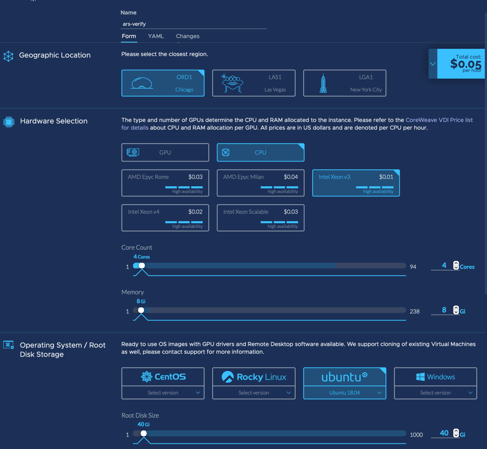
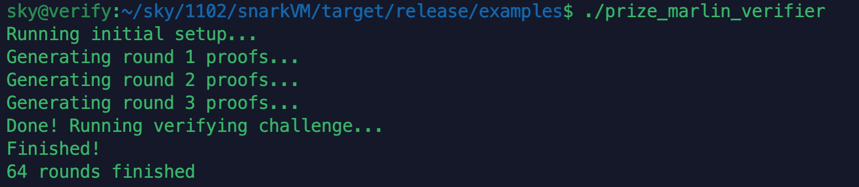

# High-Throughput Marlin Verifier


## Table of Contents

* [1. Prize Description](#1-prize-description)
* [2. Build And Run Guide](#2-build-and-run-guide)
* [3. Our Optimization](#3-our-optimization )
* [4. Source code comments](#4-source-code-comments )
* [5. The Best CoreWeare Hardware Test Results](#5-the-best-coreweare-hardware-test-results )
* [6. License](#6-license)


## 1. Prize Description

For more details click the [prize specification](https://assets.website-files.com/625a083eef681031e135cc99/63286d2f1a49c09c0bef28fd_marlin-verifier.pdf)


## 2. Build And Run Guide

### 2.1 Location of test harness source code

```bash
  dpc/examples/prize_marlin_verifier.rs
```


### 2.2 Build from source code

```bash
  cargo build --release --example prize_marlin_verifier --manifest-path ./dpc/Cargo.toml
```


### 3.3 Run the release binary

Now to use `prize_marlin_verifier`, in your terminal, run:

```bash
  ./target/release/examples/prize_marlin_verifier
```


## 3. Our Optimization

Optimization For details, view and download [Marlin_Verify_Optimization.pdf](./Marlin_Verify_Optimization.pdf)


## 4. Source code comments

There are comments at the source code optimization position

```rust
/// Modified by ars
/// xxxxxx
```

or

```rust
/// Add by ars
/// xxxxxx
```


## 5. The Best CoreWeare Hardware Test Results

### 4.1 Our best performing machine configuration





| Platform        |   GPU Cards   | Cpu                                       | Cores   | Memory | System Version | 10-second period | cost per hour | (10-second period)/(cost per hour) |
| --------------- | :-----------: | ----------------------------------------- | ------- | ------ | -------------- | ---------------- | ------------- | ---------------------------------- |
| CoreWeave cloud | Intel Xeon V3 | Intel(R) Xeon(R) CPU E5-2696 v3 @ 2.30GHz | 4 Cores | 8Gi    | Ubuntu 18.04   | 64 rounds        | $0.05         | **1280 rounds**                    |


## 6. License

[](./LICENSE.md)

[](./LICENSE_MIT.md)

[](./LICENSE_Apache-2.0.md)


